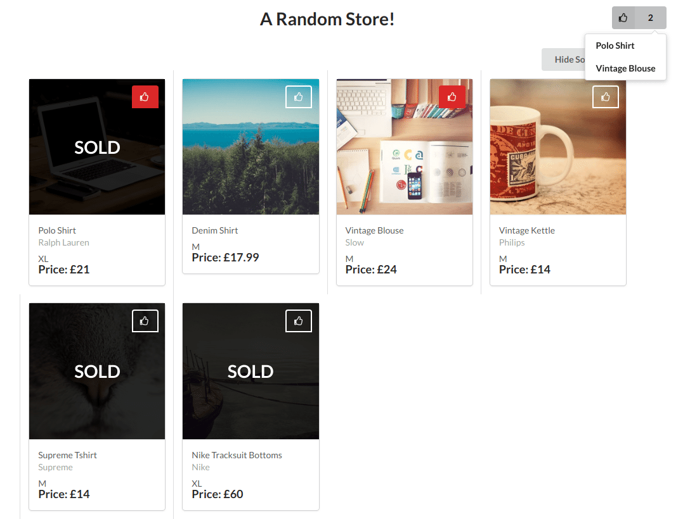
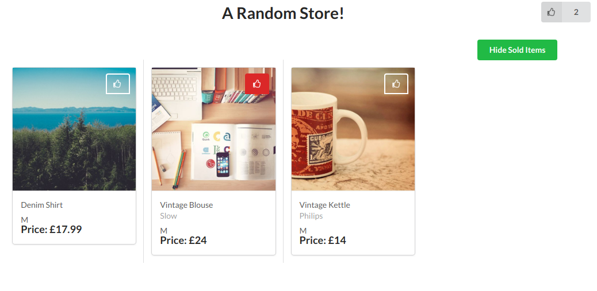

# Depop
Depop is a React.js front-end shop page that follows the design from [here](https://drive.google.com/file/d/1XssSAHxZD2T66V0SxysKkkBSVqbGW5QX/view).

## Requirements

* Retrieve data from the given API endpoint;
* Display the list of products;
* Add functionality to like/unlike a product;
* Add functionality to show/hide sold items;

## Installation

To install dependencies, clone the repo to a machine with [Node](https://nodejs.org/en/) installed and run:
```
npm install
npm start
``` 
**Screen: Show All Items:**


**Screen: Hide Sold Items:**


## Approach  

### Components

All data are fetched in the 'Page' component `#HomePage` then processed and stored into state:
```
state = { 
  products: [all-products-objects],
  unsold: [unsold-products-objects],
  showAll: boolean => true,
  likeStatus: {
    itemTitle: boolean => false}
}
```  
Required states are then passed to the stateless 'View' components `#ItemView` and `#LikeCountView` to render html in desired design.

### Like Status  
Like status store only the item title and all items default as false as the beginning. If more functions are to be implemented on the `#LikeCountView` dropdown (e.g. dropdown item onclick redirects to item's details page), this state should be better configured to support the enhancement. For now, since only the title of the liked items are displayed, it is simply stored like this.
